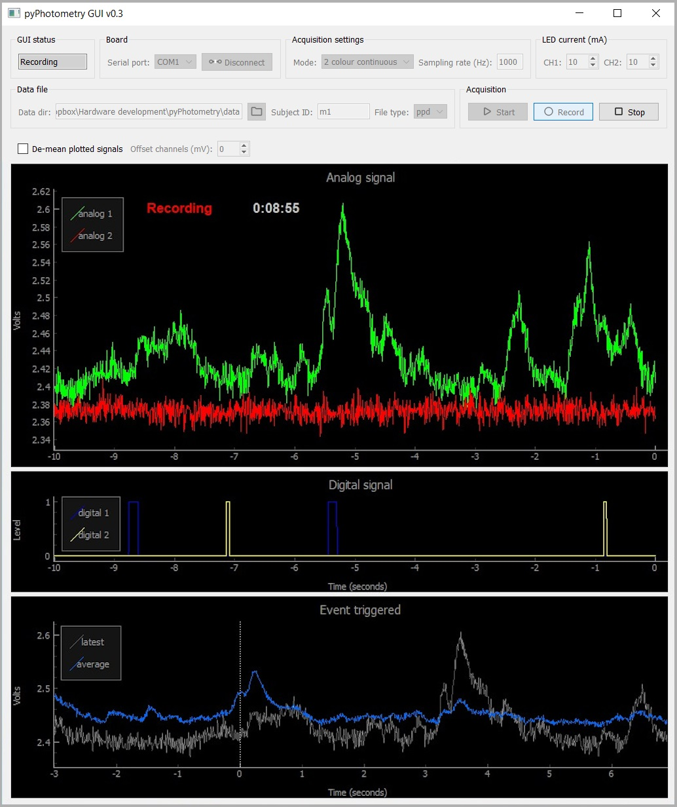

# pyPhotometry GUI



The pyPhotometry GUI provides a graphical interface for controlling data acquisition and visualising signals.  The GUI is split into a control panel at the top and a set of plots underneath.

# Control panel

The controls are grouped into boxes with the following fuctions:

---

### GUI status

Indicates the current state of the GUI / acquisition board.

---

### Board

Select an aquisition board from the dropdown menu and connect/disconect to the selected board with the button.

---

### Acquisition settings

Select aquisition mode from the dropdown menu and specify the sampling rate for data aquisition.  The available acquisition modes are:

`2 color continuous` Signals are aquired from two photorecievers (analog inputs 1 and 2) with both LEDs on continuously during aquisition.

`2 colour time div.` Signals are aquired from two photorecievers (analog inputs 1 and 2) using time division illumination and baseline subtraction. The acqusition sequence is:

```
1. Turn LEDs 1 and 2 off. Read analog 1 baseline.

2. Turn LED 1 on. Read analog 1 sample, subtract baseline, return as signal 1.

3. Turn LEDs 1 and 2 off. Read analog 2 baseline.
  
4. Turn LED 2 on. Read analog 2 sample, subtract baseline, return as signal 2.
```

Time division illumination means that crosstalk between the two signals is determined by both the absorbtion and emission spectra of the two flurophores, rather than just by the emission spectra as with continuous illumination.  For flurophores where the emission spectra overlap significantly (e.g. GCaMP with TdTomato or RCaMP) this can very substantially reduce crosstalk.  

Baseline subtraction makes the signals insensitive to bleed-through of ambient light levels, and reduces the influence of 1/f noise similarly to lock in amplification.

Due to these advantages this aquisition mode is recommended over continuous illumination for two colour measurements.

`1 colour time div.` Uses the same acquistion sequence as `1 colour time div.` except that signal 1 and signal 2 both read analog input 1 (i.e. a single photoreciever).  The typical use case is alternating illumination of GCaMP with 470nm and 405nm LEDs to provide a calcium sensitive and a calcium insensitive (isosbestic) signal for use as a movement control. 

The maximum sampling rate is 1 KHz for the continous illumination mode and 130 Hz for the time division illumination modes.

---

### LED current

Adjust the current for LEDs 1 and 2 over a range of 0 - 100mA.

---

### Data file

Specify the directory where data files will be saved and the subject ID.  File names are determined by the subject ID and the date and time the recording started, e.g. `m1-2018-08-30-103945.ppd`.

---

### Controls

The *Start* button starts data aquisition.  The *Record* button starts recording data to disk, it is greyed out unless a subject ID and a valid data directory are specified.  When recording is started the file name is copied to the clipboard. The *Stop* button stops data aquisition. 


# Plots

The plot panels display data during acquisition.  The plots can be resized by dragging the dividers between them.  Right clicking on plots brings up a context menu that allows the axis ranges to be set manually or to autoscale.

---

### Analog signal

Scrolling plot displaying the analog signals.

---

### Digital signal

Scrolling plot displaying the digital signals.

---

### Event triggered

An event triggered average of analog signal 1 triggered on rising edges of digital signal 1. The average is recency weighted with an exponential decay of time constant 5 events.