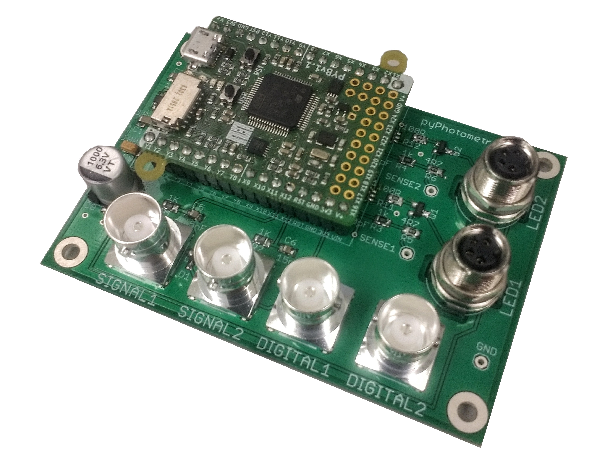

# Acquisition board

The pyPhotometry acquisition board uses a [Micropython](https://micropython.org/) microcontroller to acquire two digital and two analog signals, and to generate analog control signals for two built in LED driver circuits.  The acquisition board draws power from the Micropython's USB connector and requires no additional power supply.

## Safety

To prevent short circuits due to contact with metal objects, the board should be securely mounted using M3 bolts and insulating spacers.  The mounting holes on the acquisition board have a 50 x 75mm spacing so the board can be mounted directly on a Thorlabs metric optical breadboard using M6 to M3 thread adaptors.

Though the LED drivers are relatively low power, care should be taken to avoid shining light directly into the eye.  This is particularly important with LEDs whose wavelength lies outside the visible spectrum.

## Analog inputs

The two BNC analog inputs `SIGNAL 1` and `SIGNAL 2` receive fluorescence signals as analog voltages from the photodetectors.  The signals pass through an RC lowpass filter with a cuttoff frequency of 10KHz and then are read by the Micropython board's analog to digital converters (ADCs).  The Micropython ADCs have a 0 - 3.3V input range.  As the ADC pins are not 5V tolerant, clamp diodes to the 3.3V rail are used to prevent damage if the signal rises above 3.3V. [Oversampling](https://www.silabs.com/documents/public/application-notes/an118.pdf) is used to increace the 12-bit resolution of the ADCs to 15 bits - i.e. to generate each sample the ADC is read 64 times and averaged, giving an extra 3 bits of resolution.  

## Digital inputs

The two BNC digital inputs are compatible with 5V or 3.3V logic and are typically used to acquire sync pulses or timestamps, e.g. generated by behavioural hardware.  The digital inputs connect directly to pins on the microcontroller.

## LED drivers

The aquisition board has two constant current LED driver circuits which are controlled by the Micropython's digtal to analog converters (DACs), allowing the LED current to be adjusted between 0 - 100mA.  The LED driver outputs are M8 connectors that are compatible with either [Doric](http://doriclenses.com/life-sciences/led-modules/783-connectorized-led.html) or [Thor Labs](https://www.thorlabs.com/newgrouppage9.cfm?objectgroup_id=5206) connectorized LEDs.  

The LED driver circuits are voltage controlled current sinks in which an op amp adjusts the voltage at an N-MOSFET's gate to bring the voltage across a sense resistor in series with the LED into agreement with a voltage control signal generated by the microcontroller.  A resistor between the 3.3V rail and the inverting input of the op amp raises the voltage at the inverting input slightly above 0V when the LED current is 0A, ensuring the MOSFET is fully turned off when the control voltage is 0V.  The LED current can be monitored by monitoring the voltage between the *SENSE1* or *SENSE2* and *GND* connections on the acquisition board, which is the voltage across the sense resistors (4.7 ohm) in series with the respective LEDs. 

# Additional components

To make a complete photometetry system the acquisition board needs to be paired with LEDs, photorecievers, filter cubes and other optical components.  A [parts list]() for a complete set of additional components that can be used with the aquisition board for green/red two colour experiments (e.g. GCaMP/TdTomato) is provided in the hardware repository.  

If you plan to use the time-division multiplexed illumination modes ensure that the photodetectors used have sufficient bandwidth.  We use [Newport 2151](https://www.newport.com/p/2151) photorecievers which have a bandwidth of 0-750 Hz.

The mounting holes on the acquisition board have a 50 x 75mm spacing so the board can be mounted directly onto a Thorlabs metric optical breadboard using mM6 to M3 thread adaptors.

